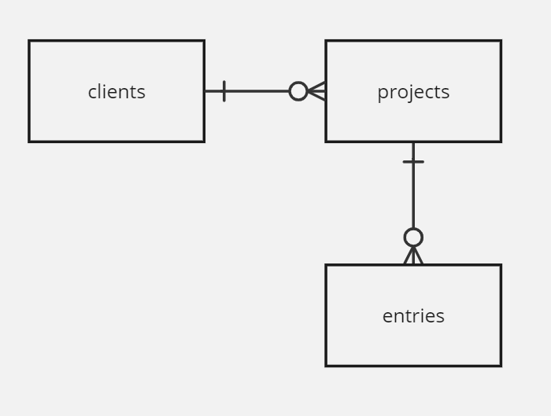

# Practice1 Scenario

- timesheets:
  - track time spent on different clients AND different projects (potentially for each client)
  - there will be multiple clients
  - each client can have 0 or more projects
  - main db will be a series of time entries - for a client, their projects, start-time, end-time

- entities:
  - clients : list of clients
  - projects : are associated with clients
  - entries : are associated with projects

- ERD diagram: 

- db and tables : see 01-db.sql

