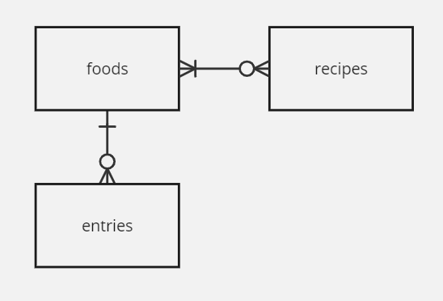

# Practice Scenario 2

## MacroNutrients
  - track macronutrients consumed from various foods based on a daily log
  - there will be multiple foods in a 'library' which may be consumed or used within recipes; within this library, we store nutrition facts for each food
  - the entries log will capture what was eaten, when
    - foods could be from recipes or from the library
  - need to be able to pull reports to summarize macronutrients based on what was eaten

- entities:
  - foods : "ready-to-eat" list of foods and associated data 
  - ingredients : food that may be used in recipes or ready to eat
  - recipes : comprised of various portions of ingredients (w/ associated data)
  - entries : the "log" - comprised of entries

- ERD diagram: 

- db and tables : see 02-db.sql

- practice queries:
  - each recipe with all food ingredients
  - summary (totals) of foods eaten each day 

